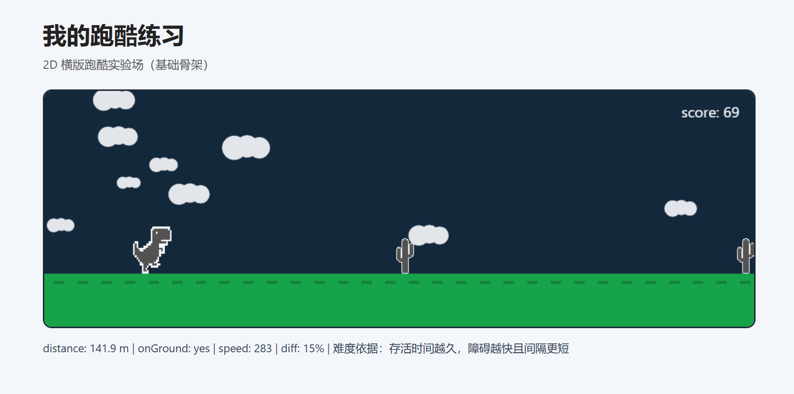

# My Dino Lab

一个基于原生 `HTML + CSS + JavaScript(Canvas 2D)` 的横版跑酷小游戏练习项目。  
整体灵感与玩法参考 Chromium 小恐龙方向，并在此基础上做了教学化和可调参数化实现。

## 项目预览

### 展示图



### 运行演示


## 当前功能

- 三阶段流程：`READY`（待开始）→ `PLAYING`（进行中）→ `GAMEOVER`（结束可重开）
- 玩家动作：跳跃（含 jump buffer / coyote time）与下蹲
- 障碍类型：小仙人掌 / 大仙人掌 / 蝙蝠（含基础动画）
- 难度曲线：随存活时间提升速度并收紧障碍间隔
- 计分系统：分数独立累积，随难度轻微加速，增长更平滑
- 视觉元素：滚动地面条纹、飘动云朵、精灵图渲染
- 碰撞判定：AABB + 玩家/障碍 hitbox 内缩优化

## 目录结构

```text
my_dino_lab/
├─ index.html          # 页面入口
├─ styles.css          # 样式
├─ game.js             # 游戏核心逻辑（状态、循环、输入、物理、渲染）
├─ assets/
│  ├─ player/          # 玩家精灵资源
│  └─ obstacles/       # 障碍精灵资源
├─ result.png          # 项目展示图
├─ show.gif            # 运行演示
└─ Teaching-AI.md      # 本项目使用的提示词与教学过程说明
```

## 本地运行

这是一个静态前端项目，无需构建步骤。

1. 克隆或下载仓库
2. 使用浏览器直接打开 `index.html`，或通过本地静态服务启动
3. 开始游戏

> 建议使用本地静态服务（如 Live Server）进行调试，体验更稳定。

## 操作说明

- `Space`：开始游戏（在 READY 阶段）
- `ArrowUp`：跳跃
- `ArrowDown`：下蹲（按住）
- `R`：重开（在 GAMEOVER 阶段）

## 参考

- 玩法与结构参考（GitHub）：[wayou/t-rex-runner](https://github.com/wayou/t-rex-runner)

## 关于本项目的 AI 协作

- 本项目代码主要通过 Cursor 协作完成
- 提示词与教学拆解记录见：[`Teaching-AI.md`](./Teaching-AI.md)

